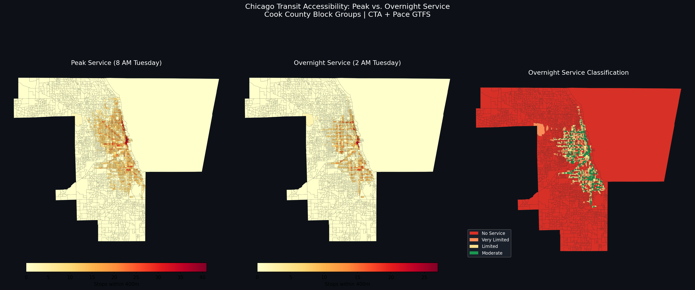

# The Invisible Commute: Mapping Shift Worker Transit Gaps After Midnight



## Overview

Public transit systems are designed around peak commuters. But millions of workers — nurses, warehouse staff, hotel cleaners, airport crews — work shifts that start or end between midnight and 5 AM, when transit is severely reduced or nonexistent. These workers are disproportionately low-income and people of color.

This project builds a **time-dependent transit accessibility model** for Chicago that:
- Quantifies where overnight service gaps leave shift workers stranded
- Identifies which employers generate the most unserved overnight trips
- Proposes optimized late-night routes based on actual employment flow data

## Study Area

**Chicago, IL** — CTA publishes high-quality GTFS data; overnight service exists but is severely limited (select bus routes only, no rail after ~1 AM). Massive overnight employment base: hospitals (Near West/South Sides), O'Hare and Midway airports, logistics hubs in south suburbs.

## Research Question

> Where are the largest gaps between where overnight shift workers live and where they work relative to available transit service between midnight and 5 AM, and what would an optimized late-night transit network look like to close the most critical gaps?

## Data Sources

| Dataset | Source | Format |
|---------|--------|--------|
| Transit Schedules (GTFS) | CTA / Pace | GTFS (CSV) |
| Employment Origin-Destination | LEHD LODES (Census) | CSV |
| Worker Demographics | American Community Survey | CSV |
| Employer Locations | OpenStreetMap + NAICS | GeoJSON |
| Hospital Locations | HIFLD Open Data | Shapefile |
| Vehicle Ownership / Income | ACS Tables B08141, B19013 | CSV |

## Methodology

### Phase 1 — Transit Network Time-Dependency Analysis
- Parse GTFS feeds for CTA and Pace
- Build peak (8 AM) and overnight (2 AM) network snapshots
- Generate 30/45/60-minute walking+transit isochrones per census block group
- Calculate **Transit Access Delta** = % reduction in reachable area 8 AM → 2 AM

### Phase 2 — Overnight Employment Flow Mapping
- Download LEHD LODES OD data at census block level for Illinois
- Filter to shift-work sectors: healthcare (NAICS 62), transportation/warehousing (NAICS 48–49), accommodation/food service (NAICS 72)
- Build origin-destination flow lines; overlay on 2 AM service area
- Classify trips as "served" vs "unserved"; aggregate to **Stranded Worker Density**

### Phase 3 — Equity and Demographic Analysis
- Join ACS vehicle ownership, income, race/ethnicity to block groups
- Build **Transit Dependency Index** (low vehicle ownership + low income + high overnight employment flows)
- LISA bivariate clustering to identify hot spots of high dependency + poor overnight service
- Map against racial/ethnic composition for environmental justice analysis

### Phase 4 — Route Optimization and Visualization
- Location-allocation model (maximize coverage) using Stranded Worker Density as demand weights
- Propose 4 new late-night routes connecting high-demand clusters to overnight employment centers (medical district, O'Hare, Midway/logistics, west side hospitals)
- **Interactive Mapbox GL JS web map** with 8 AM vs 2 AM toggle, flow lines, equity hot spots, proposed routes

## Technical Stack

| Component | Tool |
|-----------|------|
| GTFS Analysis | Python (`partridge`, `geopandas`) |
| Network Analysis | `osmnx`, `networkx` |
| LODES Processing | `pandas`, `geopandas` |
| Spatial Statistics | `esda`, `libpysal` (LISA) |
| ACS Data | `census` Python package |
| Visualization | `folium`, `matplotlib`, `plotly` |
| Web Map | Mapbox GL JS |
| Database | GeoPackage / GeoJSON |

## Project Structure

```
commuter-gaps/
├── data/
│   ├── raw/          # Downloaded source data
│   └── processed/    # Analysis-ready files
├── scripts/
│   ├── 01_download_data.py      # All data acquisition
│   ├── 02_gtfs_analysis.py      # Phase 1: transit time-dependency
│   ├── 03_lodes_analysis.py     # Phase 2: employment flow mapping
│   ├── 04_equity_analysis.py    # Phase 3: LISA + equity
│   └── 05_route_optimization.py # Phase 4: route proposals + web map
├── outputs/
│   ├── maps/         # Static cartographic outputs
│   └── figures/      # Charts and statistical plots
└── docs/
    └── index.html    # Interactive Mapbox GL JS application (GitHub Pages)
```

## Key Findings

| Metric | Value |
|--------|-------|
| Cook County block groups with **zero** overnight transit service | **2,543 / 4,002 (63.5%)** |
| Mean transit access delta (8 AM → 2 AM) | **32.7%** |
| Cook County shift-work OD trips unserved at 2 AM (weighted by dest shift-share) | **392,390 / 486,580 (80.6%)** |
| Cook County all-sector OD pairs unserved at 2 AM | **1,234,895 / 1,564,001 (79.0%)** |
| Global Bivariate Moran's I (TDI × Service Loss) | **0.184** (p = 0.002) |
| HH cluster minority share vs county average | **72.0% vs 59.5% (1.21x disparity)** |
| Proposed Route 1 — South Side Medical Corridor (25.5 km) | ~730 est. riders/day |
| Proposed Route 2 — Midway / Logistics Express (16.7 km) | ~130 est. riders/day |
| Proposed Route 3 — West Side Hospital Link (23.3 km) | ~504 est. riders/day |
| Proposed Route 4 — O'Hare Express (48.6 km) | ~473 est. riders/day |

Shift-work trip counts are weighted by each destination block's share of jobs in Healthcare (NAICS 62), Accommodation/Food Services (NAICS 72), and Transportation/Warehousing (NAICS 48-49) — the sectors most dependent on overnight workers.

## Deliverables

- [x] Time-of-day transit service area comparison maps (8 AM vs 2 AM) → `outputs/maps/service_comparison.png`
- [x] Stranded Worker Density heatmap with employment flow overlays → `outputs/maps/stranded_workers.png`
- [x] Equity hot spot analysis (LISA bivariate clustering) → `outputs/maps/equity_hotspots.png`
- [x] Proposed late-night route map with ridership estimates → `outputs/maps/proposed_routes.png`
- [x] Interactive web application with hover tooltips and layer toggles → `docs/index.html`
- [x] All processed data → `data/processed/`

## Running the Analysis

```bash
# 1. Install dependencies
pip install -r requirements.txt

# 2. Download all data
python scripts/01_download_data.py

# 3. GTFS analysis
python scripts/02_gtfs_analysis.py

# 4. LODES employment flows
python scripts/03_lodes_analysis.py

# 5. Equity analysis
python scripts/04_equity_analysis.py

# 6. Route optimization + web map
python scripts/05_route_optimization.py
```

## Policy Relevance

This analysis directly addresses a gap that transit agencies across the US are struggling with. Findings are structured as a transit agency briefing suitable for CTA and regional planning partners. The project methodology is transferable to any city with public GTFS feeds.

---

*Analysis covers Chicago, IL. Data sources are all publicly available at no cost.*
